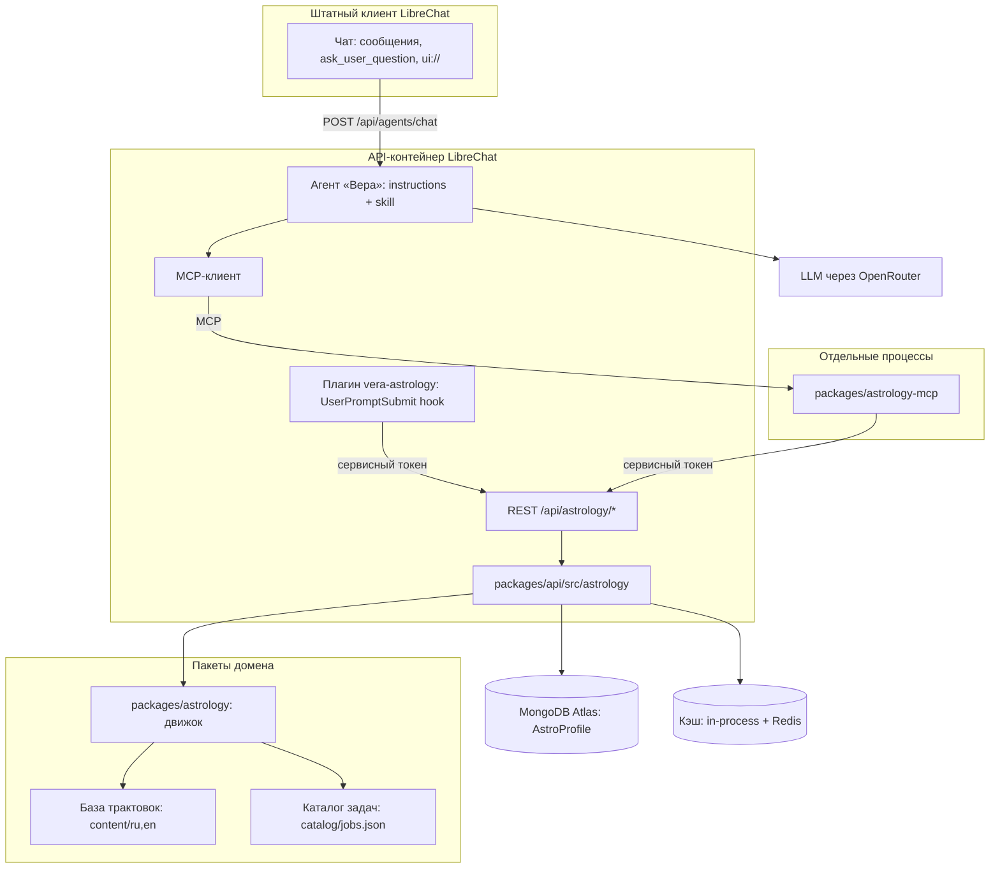
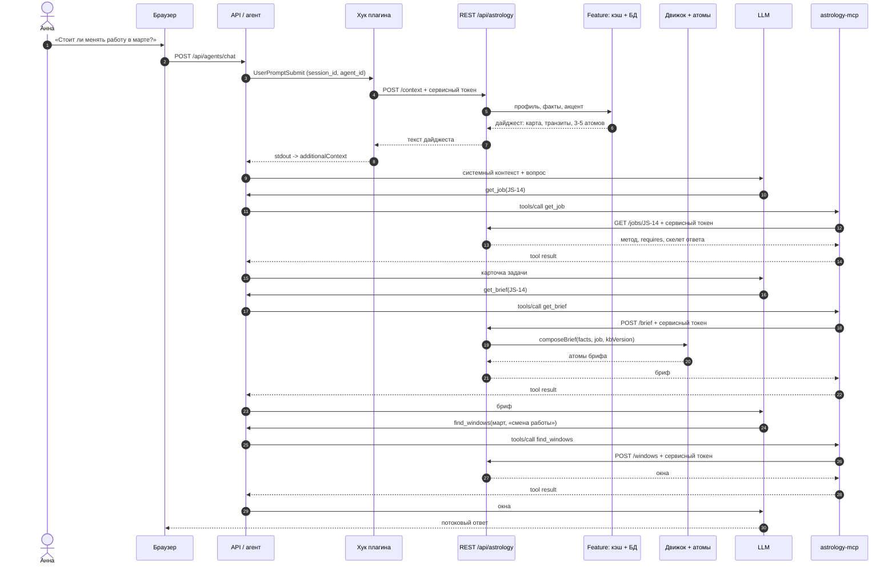
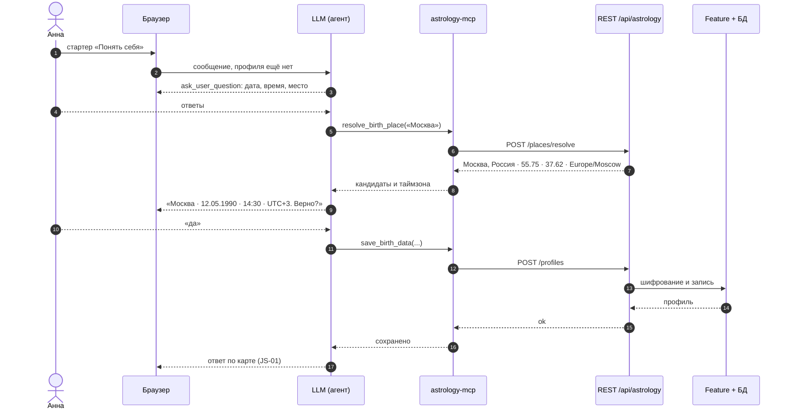
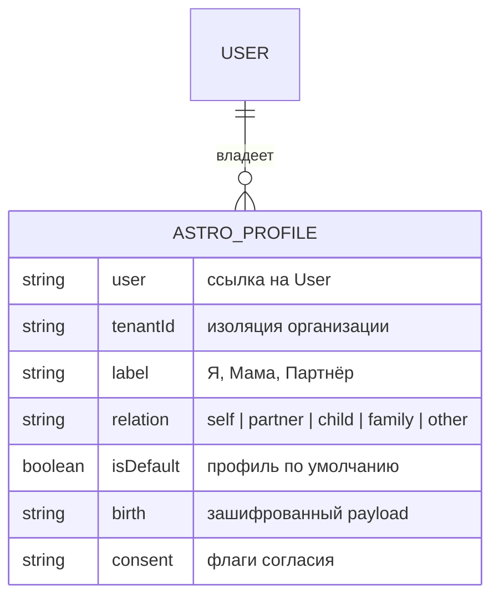
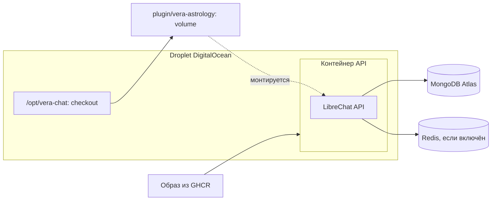

# Vera Astrology — архитектура системы

Пояснительный документ к [`astrology.md`](./astrology.md): что представляет собой система,
из каких частей состоит, как они связаны и что происходит в одном ходу диалога. Диаграммы —
Mermaid, отображаются на GitHub.

## 1. Что это такое

Приложение астрологических консультаций на базе форка LibreChat. Система:

1. собирает у пользователя данные рождения (дата, время, место) прямо в чате;
2. детерминированно считает натальную карту и текущие транзиты отдельным TypeScript-движком;
3. подаёт эти точные числа модели как системный контекст на каждом ходу;
4. отдаёт модели выверенные трактовки из базы атомов по запросу на конкретную тему;
5. по запросу модели считает дополнительные срезы (диапазоны транзитов, соляр, синастрия,
   элективные окна) через MCP-инструменты.

Ключевые свойства: **LLM не вычисляет астрологию** и **в MVP нет кастомных экранов** — весь
сценарий идёт через штатный чат LibreChat с агентом.

## 2. Компоненты

| Компонент                      | Что делает                                                     | Где живёт                                      | Кто создаёт       |
| ------------------------------ | -------------------------------------------------------------- | ---------------------------------------------- | ----------------- |
| `packages/astrology`           | Чистый движок: карта, транзиты, окна, дайджест, `composeBrief` | npm-пакет в репозитории                        | команда           |
| `packages/astrology/content`   | База трактовок: атомы RU/EN, версия `kbVersion`                | JSON в репозитории                             | контент-редактор  |
| `packages/astrology/catalog`   | Каталог задач: темы, `requires`, скелеты, `briefTags`, приёмка | JSON в репозитории                             | команда           |
| `packages/api/src/astrology`   | Профили, шифрование, кэш, REST API, каталог задач              | приложение                                     | команда           |
| `packages/astrology-mcp`       | MCP-сервер: инструменты, вызывающие REST API                   | отдельный процесс                              | команда           |
| `plugin/vera-astrology`        | Deployment-плагин: hook, `mcp.json`, `instructions.md`, skill  | каталог в репозитории, монтируется в контейнер | команда + контент |
| Агент «Вера» + model spec      | Персона, 4 стартера-категории, артефакты, привязка MCP         | БД + `librechat.yaml`                          | оператор          |
| Mongo-коллекция `AstroProfile` | Данные рождения (зашифрованы)                                  | MongoDB Atlas                                  | оператор          |
| Кэш                            | Факты, дайджесты, брифы                                        | in-process + Redis                             | приложение        |
| Штатный чат                    | Диалог, `ask_user_question`, `ui://`-ресурсы, artifacts        | React-клиент LibreChat                         | upstream          |

## 3. Компонентная диаграмма

REST-поверхность `/api/astrology/*` одна для машинных потребителей; различаются только режимы
доступа:

- **Сервисный токен (hook и MCP):** `POST /context` — дайджест с акцентом атомов для hook;
  `/places/resolve`, `/profiles` — сбор данных рождения; `/jobs`, `/brief` — каталог задач и
  трактовки; `/transits`, `/windows`, `/synastry`, `/return` — расчёты с явным `userId`.
- **JWT пользователя (браузер):** отложен до появления хаба или формы в настройках; в MVP
  браузер работает только через штатный чат.

Границы решения: **ни один upstream-файл не редактируется**. Hook и MCP — две штатные точки
расширения LibreChat (Agent Plugins и MCP), а вся логика и доступ к данным остаются в нашем
коде внутри `packages/api/src/astrology`.

## 4. Один ход диалога

- **Hook** инициирует система: карта, транзиты и акцент трактовок гарантированно попадают в
  контекст до генерации.
- **Каталог** даёт теме контракт: `get_job` возвращает метод, `requires` и скелет ответа;
  `get_brief` проверяет `requires` и отдаёт атомы по `briefTags`.
- **MCP** инициирует модель: бриф по выбранной теме и любые дополнительные расчёты.
- Оба пути используют один и тот же REST API, поэтому кэш, конфиг, шифрование и tenant-правила
  не дублируются.

## 5. Первый запуск: сбор данных рождения

Запись выполняется только после явного подтверждения; третьи лица требуют отдельного согласия.

## 6. Место базы трактовок

- **Хранение:** атомы — JSON в `packages/astrology/content/{ru,en}/`, версия `kbVersion`
  фиксируется в meta фактов и в кэше.
- **Сборка:** `composeBrief(facts, jobId, kbVersion)` — чистая функция движка: выбирает и
  ранжирует атомы под тему.
- **Темы:** список и требования тем живут в каталоге (`catalog/jobs.json`), а не в skill;
  `get_job` отдаёт контракт темы, а её `briefTags` управляют выборкой атомов.
- **Доставка:** акцент из 3–5 атомов едет в дайджесте hook; полный бриф модель запрашивает
  инструментом `get_brief(jobId)` после выбора темы через `list_consultation_jobs` / `get_job`.
- **Кэш:** `(profileId, jobId, kbVersion, catalogVersion)`; изменение контента или каталога
  инвалидирует брифы.
- **Контроль качества:** тесты покрытия ключей (планета×знак, планета×дом, аспекты) и снэпшоты
  брифа на эталонных картах; правки — только через PR.

## 7. Модель данных

- Уникальность: `{user, label, tenantId}`; один профиль по умолчанию на пользователя.
- `birth` шифруется (`CREDS_KEY` / `CREDS_IV`), не попадает в логи и публичные проекции.
- `ChartFacts` не хранятся как источник правды: они детерминированно вычисляются и кэшируются.
- Удаление пользователя удаляет профили; все записи скоупятся по `tenantId`.

## 8. Развёртывание

Операционные требования: `DEPLOYMENT_PLUGIN_HOOKS=true`, сервисный токен для hook и MCP в `.env`,
volume с плагином в `deploy-compose.vera.yml`, TLS перед хранением данных рождения (см.
[`../vera-docs/deployment.md`](../vera-docs/deployment.md)).

## 9. Поведение при отказах

| Отказ                                | Поведение                                                       |
| ------------------------------------ | --------------------------------------------------------------- |
| Hook не сработал или REST недоступен | Ход идёт без дайджеста (fail-open); модель может вызвать MCP    |
| Нет профиля рождения                 | Агент собирает данные через `ask_user_question`                 |
| Неизвестное время рождения           | Whole-sign дома, без ASC/MC; однократное предупреждение в чате  |
| Место неоднозначно                   | `resolve_birth_place` показывает кандидатов, запись ждёт ответа |
| Пользователь не подтвердил данные    | Профиль не сохраняется                                          |
| Ошибка движка                        | Ответ «расчёты недоступны», без выдуманных положений            |
| MCP-сервер недоступен                | Инструменты не отвечают; hook-путь продолжает работать          |
| Неверный или отсутствующий токен     | REST API отвечает 401, наружу ничего не утекает                 |

## 10. Чего в системе нет

- Кастомных экранов в MVP: мастер, хаб и карточка карты отложены; чат-first.
- Правок upstream-файлов LibreChat: интеграция только через плагин, MCP и конфиг.
- Встроенных инструментов в `api/app/clients/tools`: они требуют изменений в дереве исходников.
- Actions (OpenAPI): не передают личность пользователя в HTTP-запрос, поэтому профиль по ним
  не найти.
- Прямого доступа MCP или плагина к Mongo: единственный владелец персональных данных — REST API
  в `packages/api/src/astrology`.
- Отдельного «внутреннего» API: hook, MCP и (в будущем) браузер ходят в один и тот же REST,
  различается только режим аутентификации.
- Ведической традиции, ректификации и элективных окон в MVP: это следующие фазы.

## 11. Связанные документы

- [`astrology.md`](./astrology.md) — контракт: решения, интерфейсы, данные, верификация.
- [`astrology-prompts.md`](./astrology-prompts.md) — черновики инструкций агента и методики.
- [`astrology-explained.md`](./astrology-explained.md) — разбор терминов и потоков (EN).
- [`astrology-explained.ru.md`](./astrology-explained.ru.md) — то же на русском.
