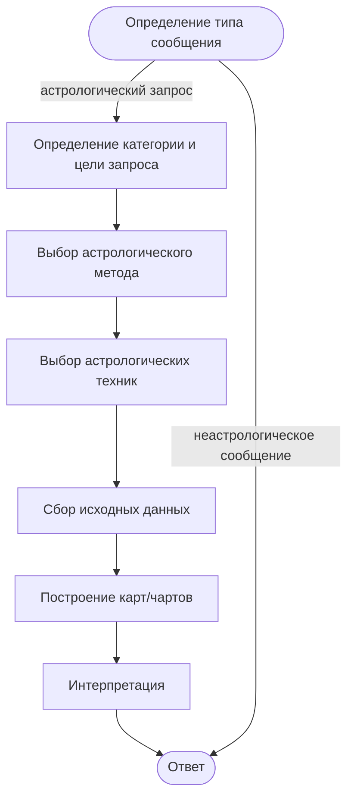

# Astrologer agent — requirements snapshot

- Source: Vera project (Google Docs) → Agents → Astrologer — <https://docs.google.com/document/d/1FPWwErD2LrCurpZ1-wtL6PYRqXorZBSMKcVQzzGjNfY/edit?tab=t.ez58ri8rm3vb>
- Snapshot taken: 2026-09-24

> This is a point-in-time copy of the product requirements used as the behavior contract for
> `openspec/changes/astrologer-agent`. The Google Doc remains the living source; if they diverge,
> the document wins. It is not an OpenSpec artifact: validation, `status`, and archive ignore it,
> and it travels with the change folder.

# Astrologer agent

## 1. Определение типа вопроса

### Бизнес-логика:

Понять, является ли сообщение пользователя *астрологическим запросом*. Если запрос астрологический - переходим к определению категории и цели запроса, запускаем астрологический рабочий процесс. Если это неастрологическое сообщение - переходим к определению категории сообщения.

### Правила:

- К астрологическим относим сообщения, где пользователь явно просит астрологическую интерпретацию/обучение или задаёт персонализированный вопрос о себе, отношениях, карьере, деньгах, переезде, повторяющихся сценариях и выборе времени, который можно раскрыть через натальную карту, транзиты, синастрию, прогрессии и т.п. Отсутствие слов «гороскоп», «натальная карта» не делает запрос неастрологическим, если он личный и требует символической интерпретации.
- Неастрологическими считаем приветствия, благодарности, сервисные вопросы, бытовые советы и запросы из других компетенций - медицины, права, финансов, - если в них нет запроса на астрологический разбор.
- Если сообщение нельзя отнести ни к одной из категорий астрологических запросов - это маркер того что сообщение не является астрологическим запросом.
Примеры:

| **Сообщение пользователя** | **Класс** | **Обоснование** |
| --- | --- | --- |
| «Мы с партнёром всё время ссоримся на ровном месте. Есть ли смысл продолжать?» | Астрологический запрос | Нет явных астро-терминов, но это личный вопрос о совместимости и динамике отношений. Можно разбирать через синастрию, композит, натальные карты обоих. |
| «В каком месяце лучше планировать свадьбу?» | Астрологический запрос | Нет слов «гороскоп» или «транзиты», но есть запрос на выбор времени. Это элективная астрология и анализ транзитов/прогрессий. |
| «Почему мне всегда попадаются эмоционально недоступные мужчины?» | Астрологический запрос | Личный повторяющийся сценарий в отношениях. Может интерпретироваться через 7 дом, Венеру, Марс, аспекты и синастрию. |
| «Что такое ретроградный Меркурий?» | Астрологический запрос | Явный астрологический термин, запрос на обучение/объяснение в рамках астрологии. |
| «Сколько стоит подписка?» | Неастрологическое сообщение | Сервисный/технический вопрос, не требует астрологической интерпретации и не может быть раскрыт через карты. |

## 2. Определение категории и цели запроса

### Бизнес-логика:

Определить категорию и цель запроса. Категория и цель необходима для подбора астрологического метода.

### Правила:

Список категорий:

| **Категории** | **Примеры** |
| --- | --- |
| **Self** | личность, сильные стороны, жизненные паттерны |
| **Relationships** | любовь, партнёрство, совместимость |
| **Career** | работа, профессиональное развитие |
| **Money** | финансовые тенденции, отношение к деньгам |
| **Life events** | переезд, важные изменения, жизненные периоды |
| **Decision** | конкретный выбор/вопрос |

Список целей:

| **Цель** | **Что хочет пользователь** |
| --- | --- |
| **Self-understanding** | Понять себя, свои качества, паттерны |
| **Understanding** | Понять ситуацию / причины происходящего |
| **Compatibility** | Понять динамику отношений с другим человеком |
| **Prediction** | Узнать о вероятном развитии ситуации |
| **Timing** | Определить период/момент события |
| **Decision** | Получить астрологический взгляд на конкретный выбор |
| **Event selection** | Выбрать подходящее время для запланированного действия |

## 3. Выбор астрологического метода

### Бизнес-логика:

Астрологический метод определяется на основе категории и цели запроса. Определение астрологического метода необходимо для последующего определения астрологических техник.

### Правила:

- На данный момент мы рассматриваем только **натальный, элективный, хорарный, прогностический методы**. Остальные методы не используются.
- Агент работает на основе западной астрологической традиции.
Описание методов:

| **Метод** | **Когда применять** |
| --- | --- |
| Натальный | Когда запрос касается врождённого потенциала и устойчивых особенностей: личность, сильные стороны, повторяющиеся сценарии, совместимость, профессиональные и финансовые предрасположенности. Применяется для целей Self-understanding, Understanding, Compatibility в категориях Self, Relationships, Career, Money. |
| Прогностический | Когда нужно понять тенденции и вероятное развитие событий во времени: что ждёт в конкретный период, когда активируется тема, когда возможны возможности или напряжение. Применяется для целей Prediction, Timing в категориях Self, Relationships, Career, Money, Life events. |
| Хорарный | Когда есть конкретный вопрос «да/нет/стоит ли» и нужен ответ здесь и сейчас, без ожидания события или выбора даты. Применяется для цели Decision в категориях Relationships, Career, Money, Decision. |
| Элективный | Когда нужно выбрать подходящее время для запланированного действия: свадьба, переезд, запуск проекта, подписание договора, покупка, поездка. Применяется для целей Event selection, Timing в категориях Life events, Decision. |

Примеры:

| **Пример запроса** | **Категория** | **Цель** | **Метод** |
| --- | --- | --- | --- |
| «Какие у меня сильные стороны и куда мне развиваться?» | Self | Self-understanding | Натальный |
| «Почему я повторяю один и тот же жизненный сценарий?» | Self | Understanding | Натальный |
| «Что меня ждёт в личностном развитии в этом году?» | Self | Prediction | Прогностический |
| «Когда у меня начнётся благоприятный период для перемен?» | Self | Timing | Прогностический |
| «Подходим ли мы с партнёром друг другу?» | Relationships | Compatibility | Натальный |
| «Почему мы всё время ссоримся на ровном месте?» | Relationships | Understanding | Натальный |
| «Какие тенденции в отношениях в ближайшие полгода?» | Relationships | Prediction | Прогностический |
| «Стоит ли мне продолжать эти отношения?» | Relationships | Decision | Хорарный |
| «Какие профессии мне подходят по карте?» | Career | Self-understanding | Натальный |
| «Какие карьерные перспективы у меня на год?» | Career | Prediction | Прогностический |
| «Когда вероятнее повышение или смена работы?» | Career | Timing | Прогностический |
| «Принимать ли предложение о работе?» | Career | Decision | Хорарный |
| «Почему у меня повторяются финансовые трудности?» | Money | Understanding | Натальный |
| «Какие финансовые тенденции в этом году?» | Money | Prediction | Прогностический |
| «Когда ожидать роста доходов?» | Money | Timing | Прогностический |
| «Какие важные жизненные изменения вероятны в этом году?» | Life events | Prediction | Прогностический |
| «Какую дату выбрать для переезда/свадьбы?» | Life events | Event selection | Элективный |
| «Соглашаться ли на конкретное предложение?» | Decision | Decision | Хорарный |
| «Когда лучше начать проект или подписать договор?» | Decision | Timing | Элективный |
| «Выбрать дату запуска бизнеса/покупки/поездки» | Decision | Event selection | Элективный |

## 4. Выбор астрологических техник

### Бизнес-логика:

Категория запроса, цель запроса и выбранный метод позволяют определиться с астрологическими техниками, которые будут применены для построения астрологических карт/чартов.

### Правила:

- Астрологический метод определяет набор астрологических техник.
- Выбор конкретных техник зависит от категории запроса, цели запроса и астрологического метода.
Применимые астрологические техники:

| **Метод** | **Техника** | **Когда применять** |
| --- | --- | --- |
| Натальный | Натальная карта | Для анализа личности, потенциала, домов, планет и аспектов: Self, Career, Money, повторяющиеся сценарии, сильные стороны. |
|  | Синастрия | Для сравнения двух натальных карт: совместимость, притяжение, трения, динамика отношений. |
|  | Композит | Для анализа отношений как отдельной системы: общая атмосфера пары, смысл союза, долгосрочная совместимость. |
| Прогностический | Транзиты | Для событий и тенденций на конкретный период: когда активируется тема, периоды возможностей/напряжения. |
|  | Вторичные прогрессии | Для внутреннего развития, психологических сдвигов, медленных жизненных этапов и смены глав. |
|  | Солярные/лунарные возвращения | Для годового или месячного прогноза: акценты периода, повторяющиеся темы, важные окна. |
| Хорарный | Хорарная карта | Для конкретного вопроса «да/нет/стоит ли», когда нужен ответ здесь и сейчас. Внутри техники используются дома, сигнификаторы, рецепции и аспекты сигнификаторов. |
| Элективный | Элективная карта | Для выбора даты/времени начала действия: свадьба, переезд, запуск, подписание. Внутри техники учитываются транзиты Луны, Луна без курса и ретроградности. |

Примеры:

| **Запрос** | **Категория** | **Цель** | **Метод** | **Техники** |
| --- | --- | --- | --- | --- |
| «Какие у меня сильные стороны и куда мне развиваться?» | Self | Self-understanding | Натальный | Натальная карта |
| «Почему я повторяю один и тот же жизненный сценарий?» | Self | Understanding | Натальный | Натальная карта |
| «Что меня ждёт в личностном развитии в этом году?» | Self | Prediction | Прогностический | Солярное возвращение; вторичные прогрессии |
| «Когда у меня начнётся благоприятный период для перемен?» | Self | Timing | Прогностический | Транзиты; вторичные прогрессии |
| «Подходим ли мы с партнёром друг другу?» | Relationships | Compatibility | Натальный | Синастрия; композит |
| «Почему мы всё время ссоримся на ровном месте?» | Relationships | Understanding | Натальный | Синастрия |
| «Какие тенденции в отношениях в ближайшие полгода?» | Relationships | Prediction | Прогностический | Транзиты; лунарные возвращения |
| «Стоит ли мне продолжать эти отношения?» | Relationships | Decision | Хорарный | Хорарная карта; дома и сигнификаторы |
| «Какие профессии мне подходят по карте?» | Career | Self-understanding | Натальный | Натальная карта |
| «Какие карьерные перспективы у меня на год?» | Career | Prediction | Прогностический | Транзиты; солярное возвращение |
| «Когда вероятнее повышение или смена работы?» | Career | Timing | Прогностический | Транзиты; вторичные прогрессии |
| «Принимать ли предложение о работе?» | Career | Decision | Хорарный | Хорарная карта; дома и сигнификаторы |
| «Почему у меня повторяются финансовые трудности?» | Money | Understanding | Натальный | Натальная карта |
| «Какие финансовые тенденции в этом году?» | Money | Prediction | Прогностический | Транзиты; солярное возвращение |
| «Когда ожидать роста доходов?» | Money | Timing | Прогностический | Транзиты |
| «Какие важные жизненные изменения вероятны в этом году?» | Life events | Prediction | Прогностический | Транзиты; солярное возвращение |
| «Какую дату выбрать для переезда/свадьбы?» | Life events | Event selection | Элективный | Элективная карта; транзиты Луны |
| «Соглашаться ли на конкретное предложение?» | Decision | Decision | Хорарный | Хорарная карта; рецепции и аспекты сигнификаторов |
| «Когда лучше начать проект или подписать договор?» | Decision | Timing | Элективный | Элективная карта; транзиты Луны |
| «Выбрать дату запуска бизнеса/покупки/поездки» | Decision | Event selection | Элективный | Элективная карта; Луна без курса/ретроградности |

## 5. Сбор исходных данных

### Бизнес-логика:

После того как определены техники, агент должен собрать все входные данные, необходимые для построения карт/чартов. На этом шаге интерпретация ещё не выполняется: агент только определяет, какие данные нужны, проверяет, есть ли они в профиле или предыдущем диалоге, и запрашивает недостающие.

### Правила:

- Набор данных зависит от выбранной техники. Базово для большинства техник нужны натальные данные человека: дата, время и место рождения. Для парных техник нужны данные двух людей. Для прогностических техник дополнительно нужен целевой период. Для хорара - момент и место вопроса. Для электива - параметры события и желаемое окно.
- Если данных не хватает, агент уточняет их у пользователя. Если получить критичные данные невозможно, агент либо предлагает альтернативную технику, либо ограничивает последующую интерпретацию и честно сообщает об ограничении.
Входные параметры по техникам:

| **Техника** | **Обязательные данные** | **Опциональные данные** | **Если данных нет** |
| --- | --- | --- | --- |
| Натальная карта | Дата, время, место рождения | Имя, пол, текущее местоположение | Без времени - карта на 12:00 с ограничениями. Без места - уточняем, иначе карта не строится корректно. |
| Синастрия | Натальные данные обоих людей | Статус отношений, цель анализа | Без данных партнёра - невозможно. Fallback: натальный анализ 7 дома/Венеры/Марса. |
| Композит | Натальные данные обоих людей | Статус отношений, длительность союза | Без данных партнёра - невозможно. Fallback: синастрия или натальный анализ. |
| Транзиты | Натальные данные + целевой период | Текущее местоположение | Без периода - уточняем. По умолчанию - текущий год. |
| Вторичные прогрессии | Натальные данные + целевая дата/период | - | Без периода - уточняем. По умолчанию - текущий год. |
| Солярное возвращение | Натальные данные + год | Место возвращения | Без года - текущий год. Без места - используем место рождения или текущее местоположение. |
| Хорарная карта | Текст вопроса, дата/время вопроса, место вопроса | Натальные данные для контекста | Без точного времени или места - техника не применяется. Fallback: натальный/прогностический. |
| Элективная карта | Тип события, желаемый период, место события | Натальные данные, ограничения | Без периода или места - уточняем. Если окна нет - предлагаем ближайшие 1-3 месяца. |

## 6. Построение карт/чартов

### Бизнес-логика:

На основе выбранных техник и собранных данных агент формирует запрос к отдельному вычислительному модулю/библиотеке. LLM не выполняет астрологические расчёты и не строит карты самостоятельно. LLM только оркестрирует процесс: определяет, какие карты нужны, передаёт данные в движок и получает структурированный результат.

### Правила:

- Все вычисления - выполняются в отдельной библиотеке/движке.
- На выход движок возвращает структурированные данные: позиции, дома, аспекты, конфигурации, сигнификаторы, окна, периоды и т.п.
- Для парных техник строятся две натальные карты, затем синастрия/композит.
- Для прогностических техник строятся транзиты, прогрессии, солярные/лунарные возвращения на заданный период.
- Для хорара и электива карта строится на момент и место вопроса/события; определяются сигнификаторы, аспекты, рецепции, Луна, ретроградности, Луна без курса.
- Если критичных данных нет, карта не строится. Агент возвращается к сбору данных или применяет fallback, если он предусмотрен.
- Результат расчёта сохраняется и передаётся в интерпретацию без искажений.

## 7. Интерпретация

### Бизнес-логика:

LLM интерпретирует только те данные, которые вернул вычислительный модуль. Интерпретация привязывается к категории, цели, методу и выбранным техникам. Агент синтезирует факторы, выделяет главное и переводит астрологическую символику на понятный язык.

### Правила:

- Не добавлять факты, которых нет в расчётах.
- Приоритизировать наиболее значимые факторы для конкретного запроса.
- Учитывать ограничения данных: нет времени рождения, нет данных партнёра, нет точного времени вопроса и т.п.
- Прогностические выводы давать вероятностно, без фатализма и категоричных обещаний.
- Не давать медицинских, юридических, финансовых и психиатрических заключений. При необходимости рекомендовать профильного специалиста.
- Тон - понятный, поддерживающий, без запугивания и детерминизма.

| **Метод** | **Ключевая задача интерпретации** |
| --- | --- |
| Хорар | Отвечать на конкретный вопрос, показывать условия и вероятность исхода. |
| Электив | Предлагать окна и предупреждать о неблагоприятных факторах. |
| Натальный анализ | Описывать потенциал, паттерны, сильные и слабые стороны. |
| Прогностика | Выделять периоды, тенденции и возможные сценарии. |

## 8. Ответ

### Бизнес-логика:

Финальная сборка ответа зависит от типа входного сообщения. Агент не смешивает сценарии и не пытается перевести неастрологическое сообщение в астрологическое, что не является астрологическим запросом.

### Правила:

#### 1. Астрологический запрос

Агент формирует ответ на основе интерпретации:

- краткий вывод;
- ключевые астрологические факторы;
- объяснение применительно к запросу;
- рекомендации, окна, предостережения или вероятные сценарии;
- ограничения интерпретации и то, что можно уточнить.

Внутренняя реализация, промпты, устройство движка и проприетарная логика не раскрываются.

#### 2. Неастрологическое сообщение

В зависимости от категории:

| **Категория** | **Пример** | **Правила ответа** |
| --- | --- | --- |
| FAQ | «По каким техникам работает агент?» | Даётся краткий ответ по существу. Можно назвать методы верхнего уровня: натальный, прогностический, хорарный, элективный. Без раскрытия внутренней проприетарной реализации. |
| Сервисный/технический вопрос | Подписка, доступ, оплата | Краткий ответ по сервисной информации. Без астрологической интерпретации. |
| Приветствие, благодарность, светская реплика | «Привет», «Спасибо» | Вежливый короткий ответ. При уместности - предложение задать астрологический вопрос. |
| Неприемлемое сообщение, оффтоп или стоп-тема | Оффтоп, запрещённая тема | Краткий ответ не по существу. Агент не переводит тему в астрологическую, не вовлекается в обсуждение и не пытается интерпретировать такой запрос через карты. При необходимости может коротко обозначить, что не может помочь с этим запросом, и предложить астрологический вопрос. |
